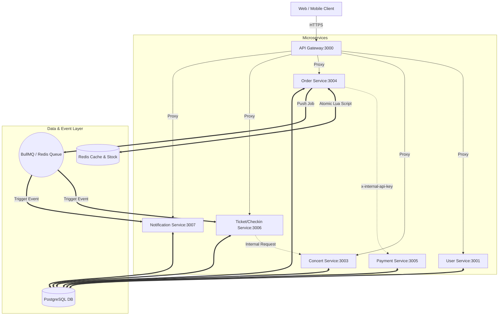

# Project Overview - TicketBox System

## 1. Mục tiêu & Tech Stack
TicketBox là hệ thống bán vé concert và soát vé thời gian thực, thiết kế theo kiến trúc **Event-Driven Microservices** nhằm chịu tải cực lớn (Flash Sale), đảm bảo tính nhất quán giao dịch và hỗ trợ soát vé offline.

*   **Frontend:** Web App (React, TypeScript, TailwindCSS) & Mobile App (React Native Expo, TypeScript).
*   **API Gateway:** Nginx làm Load Balancer và API Gateway định tuyến.
*   **Backend Microservices:** ExpressJS, TypeScript.
*   **Message Broker & Queue:** BullMQ trên nền Redis để xử lý bất đồng bộ.
*   **Database & Cache:** PostgreSQL (kiên định dữ liệu chính), Redis (caching & bộ đếm tồn kho nguyên tử).
*   **Bảo mật:** JWT & Role-Based Access Control (RBAC).

---

## 2. Danh sách Microservices & Trách nhiệm
1.  **API Gateway (Port 3000):** Đầu mối tiếp nhận, rate-limiting và điều hướng toàn bộ request từ client.
2.  **User Service (Port 3001):** Quản lý định danh, xác thực (JWT), phân quyền (RBAC) và thông tin cá nhân.
3.  **Concert Service (Port 3003):** Quản lý concert, hạng vé, sơ đồ ghế, tồn kho và tiểu sử nghệ sĩ (AI sinh).
4.  **Order Service (Port 3004):** Xử lý đặt vé, giữ chỗ tồn kho tức thời qua Redis Lua Script, quản lý vòng đời đơn hàng.
5.  **Payment Service (Port 3005):** Khởi tạo cổng thanh toán Stripe/Momo nội bộ và tiếp nhận Webhook cập nhật kết quả.
6.  **Ticket Service (Port 3006):** Quản lý phát hành vé (ký số), ví vé của user, soát vé (Check-in) và thống kê soát vé.
7.  **Notification Service (Port 3007):** Quản lý thông báo in-app và đẩy thông báo thời gian thực qua Server-Sent Events (SSE).

---

## 3. Sơ đồ giao tiếp giữa các Services

---

## 4. Luồng Nghiệp vụ Chính
*   **Đặt vé (Booking):** Khách hàng chọn vé -> Client gửi yêu cầu với `Idempotency-Key` -> `Order Service` chạy Lua Script trừ kho trong Redis -> Lưu order dạng `PROCESSING` -> Đẩy job sang `Payment Service` và trả kết quả ngay.
*   **Thanh toán & Nhận vé:** Mobile kết nối SSE tới `Order Service` -> Nhận link Stripe/Momo -> Thanh toán -> Stripe Webhook gọi `Payment Service` -> Đẩy sự kiện thành công -> `Order Service` cập nhật `COMPLETED` -> `Ticket Service` tạo vé và ký số -> `Notification Service` báo qua SSE -> Mobile tự chuyển sang ví vé.
*   **Soát vé (Check-in):** Staff quét QR của khách hàng -> Trích xuất chuỗi ký số -> Gửi tới `/checkin/verify` -> `Ticket Service` dùng Public Key kiểm tra tính toàn vẹn, xác nhận trạng thái vé và đánh dấu đã sử dụng.

---

## 5. Điểm mới & Thay đổi Kiến trúc Thực tế
*   **Gộp Dịch vụ Soát vé:** `Check-in Service` được gộp chung codebase với `Ticket Service` (Port 3006) để tối ưu tài nguyên, chỉ phân tách route ở Gateway.
*   **Chuyển đổi sang SSE:** Không sử dụng HTTP Polling để check trạng thái thanh toán. Client kết nối qua **Server-Sent Events (SSE)** tại `/orders/:id/stream` để nhận link và cập nhật bất đồng bộ, tối ưu năng lực chịu tải.
*   **Đóng cổng Thanh toán Đối ngoại:** API Gateway chặn hoàn toàn các route `/payments` từ internet. Luồng thanh toán chỉ được gọi nội bộ giữa các service thông qua khoá API `x-internal-api-key`.
